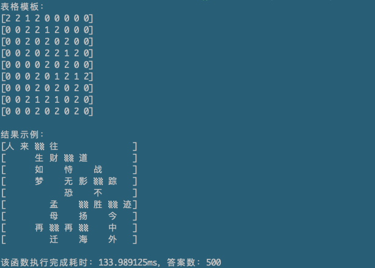

# chengyu
## 功能说明：
 用给定的一批成语，生成符合下面的布局的组合，把符合条件的结果写入result.txt文件中

|   | 鞭 |   |   |   |   |   |   
|---|---|---|---|---|---|---|
|   | ▒▒ | 命 | ▒▒ | 岁 |   |   |   
|   | 莫 |   | 家 |   | 好 |   |   
|   | 及 |   | ▒▒ | 风 |▒▒ | 醋 |   
|   |   |   | 名 |   | 懒 |   |   
|   |   |   |   |   | 做 |   |   

## 运行示例：

## TODO
- [ ] 性能优化 